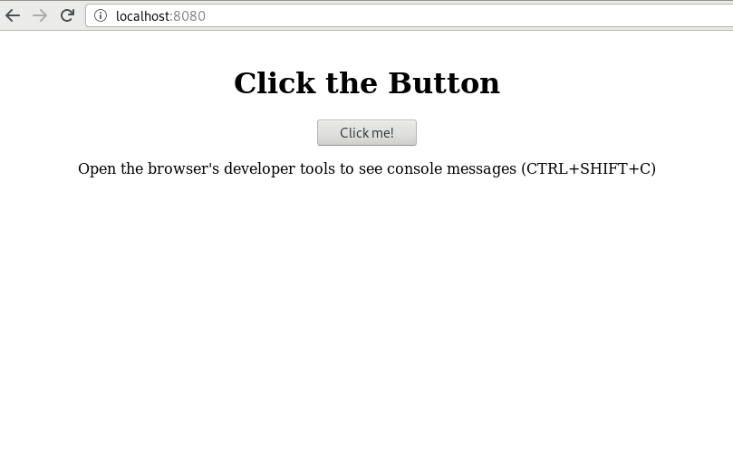
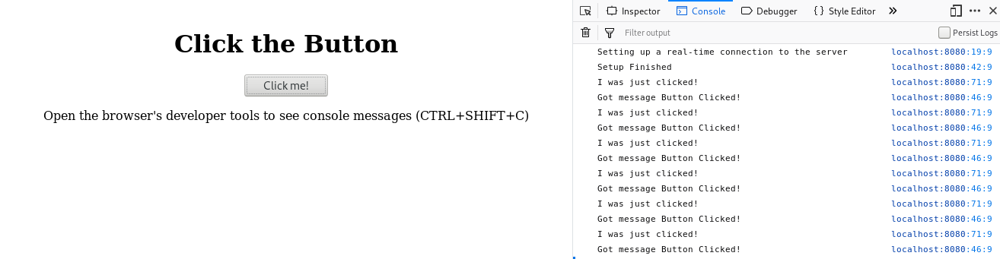

# RTC Basics

This example will show the absolute basics involved with establishing a real-time connection
between Python and your browser.

You can do this example entirely on your own computer or Raspberry Pi.

## Set up a Basic Server

First things first, we create a basic [aiohttp](https://aiohttp.readthedocs.io/en/stable/) web server
that will host an html file, and the rtcbot javascript, which is assumed to be in an `rtcbot` subfolder. We call our python file `basic.py`

```python
from aiohttp import web

routes = web.RouteTableDef()

@routes.get("/")
async def index(request):
    with open("basic.html", "r") as f:
        return web.Response(content_type="text/html", text=f.read())

routes.static("/rtcbot/",path="./rtcbot")
app = web.Application()
app.add_routes(routes)
web.run_app(app)
```

In the html file, mentioned in the python code, `basic.html`, we draw a button:

```html
<html>
  <head>
    <meta charset="UTF-8" />
    <title>RTCBot: Basic</title>
    <script src="rtcbot/rtcbot.js"></script>
  </head>
  <body style="text-align: center;padding-top: 30px;">
    <h1>Click the Button</h1>
    <button type="button" id="mybutton">Click me!</button>
    <p>
      Open the browser's developer tools to see console messages (CTRL+SHIFT+C)
    </p>
    <script>
      var mybutton = document.querySelector("#mybutton");
      mybutton.onclick = function() {
        console.log("I was just clicked!");
      };
    </script>
  </body>
</html>
```

You can now run `python3 basic.py`, and navigate your browser to `http://localhost:8080`. Try clicking on the button to make sure that a message shows up in the browser console, and make sure that no errors show up.



## A bit about WebRTC

Before going further, it is important to understand the basics of WebRTC, which is the technology used for connections in rtcbot. If you are familiar with WebRTC, feel free to skip this section.

WebRTC's core goal is fast peer-to-peer communication between clients. An example of this is video chat. Suppose you and your friend
both connect to a web server to talk with each other. The video from your friend's webcam first travels to the server, and then is forwarded from the server to you. This is not ideal - if the server is in another country, your video connection would have a lot of latency, since it needs to travel a large distance - even if you and your friend are connected to the same wifi!

WebRTC fixes this by establishing a direct connection between you and your friend - with WebRTC, the video signal would never even leave your local network, giving high quality and very low latency communication. The remote server is only used to help create the connection. Furthermore, the protocol includes mechanisms for passing connections through firewalls, and other complex network configurations.

The above technology is unimportant to us at the moment, since we will connect directly to the server anyways (no intermediate hops), but will become relevant once we try controlling the robot over a 4G connection, where the server and peer become decoupled.

Even without using the above benefits, WebRTC is a better fit than something like a websocket for controlling a robot, since it is designed from the ground up for very low latency and high throughput communication. Furthermore, it natively supports video, with video stream quality adjusting for network speed. This results in a perfect fit for our use case!

### Connection Setup

Due to all of the above benefits, establishing a WebRTC connection can be a bit involved. Three things need to happen:

1. The local device prepares the type of data it needs to be able to send or accept (raw data, video, audio, etc)
2. The local device needs to gather information about how others can connect to it, such that this data can be sent efficiently. For example, things on your local network could possibly talk with each other using local addresses, like `192.168.1.153`. Other times, they must go over the internet, where you have a different IP. The device does some setup, and gathers all the ways that the peer could connect to it. These candidate connection methods are called [ICE Candidates](https://developer.mozilla.org/en-US/docs/Web/API/WebRTC_API/Connectivity#ICE_candidates).
3. The resulting information needs to be sent to the remote device
4. The remote device needs to do the same thing, sending back its own information.
5. Finally, the two sides use this information to create a direct connection

Steps 3 and 4 involve a "Signaling Server", which sends this info from one device to the other. In our code, we will set up a data channel between the server code and the browser's javascript.

## The Javascript Side

The above steps are directly reproduced here. In your `basic.html` file's script tag, add the following:

```javascript
// The connection object
var conn = new RTCConnection();

// Print received messages in the browser console
conn.onMessage(function(channel, message) {
  console.log("Got message", message);
});

// Here we set up the connection. We put it in an async function, since we will be
// waiting for results from the server (Promises).
async function setupRTC() {
  console.log("Setting up a real-time connection to the server");

  // Get the information needed to connect from the server to the browser
  let offer = await conn.getLocalDescription();

  // POST the information to the server, which will respond with the corresponding remote
  // connection's description
  let response = await fetch("/setupRTC", {
    method: "POST",
    cache: "no-cache",
    body: JSON.stringify(offer)
  });

  // Set the remote server's information
  await conn.setRemoteDescription(await response.json());

  console.log("Setup Finished");
}

setupRTC(); // Run the async function in the background.
```

The above sets up a WebRTC connection, sends local data as a `POST` to `/setupRTC` on the server. The server is supposed to respond to this with the other side's information, and the connection can be completed.

Running this code will try creating a connection, but fail,
since the server does not handle `/setupRTC` yet. Let's fix that.

## The Python Side

We do the same procedure on the server as was done in Javascript:

```python
from rtcbot import RTCConnection

@routes.post("/setupRTC")
async def setupRTC(request):
    clientOffer = await request.json()
    conn = RTCConnection()

    @conn.onMessage
    def onMsg(c, m):
        print("Message:", m, "from", c.label)
        c.send(m)

    response = await conn.getLocalDescription(clientOffer)
    return web.json_response(response)
```

That's it from the Python side! You'll notice that nothing really happens, though. The connection is established, but no messages are being sent.

Python would send back any messages it gets from the javascript, but the Javascript is not sending any messages!

## Sending Messages

Looking back on our button in javascript, we can send a message each time it is clicked:

```javascript
var mybutton = document.querySelector("#mybutton");
mybutton.onclick = function() {
  console.log("I was just clicked!");
  conn.send("Button Clicked!");
};
```

And now we get the messages in Python:

```
======== Running on http://0.0.0.0:8080 ========
(Press CTRL+C to quit)
Got message Button Clicked!
Got message Button Clicked!
Got message Button Clicked!
Got message Button Clicked!
Got message Button Clicked!
Got message Button Clicked!
Got message Button Clicked!
Got message Button Clicked!

```

and in the browser console:



## Conclusion

That wraps up the basic tutorial. As you can see, the code here is quite barebones. The wonderful part is that not much more is needed to do things! In fact, the next tutorial adds only a couple of lines to the above code to enable streaming video from a Raspberry Pi camera!
