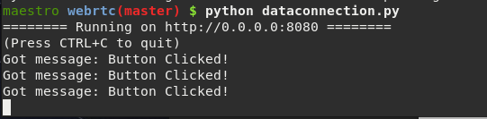

# WebRTC Basics

This example will show the absolute basics involved with establishing a real-time connection between Python and your browser.

You can run this example entirely on your Raspberry Pi, or use a browser on a desktop or laptop to connect to the Pi.
To find your Pi's IP address, run `ip address` in a terminal, which should display connection info, including an ip address, like `192.168.1.24`.

## Set up a Basic Server

To start off, we want to create an [aiohttp](https://aiohttp.readthedocs.io/en/stable/) server, which will host the html and javascript for the browser.

```python
# basic.py
from aiohttp import web
routes = web.RouteTableDef()

@routes.get("/")
async def index(request):
    return web.Response(content_type="text/html", text='''
    <html>
        <head>
            <title>RTCBot: Basic</title>
        </head>
        <body style="text-align: center;padding-top: 30px;">
            <h1>Click the Button</h1>
            <button type="button" id="mybutton">Click me!</button>
            <p>
            Open the browser's developer tools to see console messages (CTRL+SHIFT+C)
            </p>
            <script>
                var mybutton = document.querySelector("#mybutton");
                mybutton.onclick = function() {
                    console.log("I was just clicked!");
                };
            </script>
        </body>
    </html>
    ''')

app = web.Application()
app.add_routes(routes)
web.run_app(app)
```

You can now run `python3 basic.py`, and navigate your browser to `http://localhost:8080` or `http://<pi ip>:8080`. Try clicking on the button to make sure that a message shows up in the browser console, and make sure that no errors show up.


## Talking to Python from the Browser

With a basic server set up, we now add the RTCBot library both to our python and to our javascript code, and establish a WebRTC data connection between the two

```python
from aiohttp import web
routes = web.RouteTableDef()

from rtcbot import RTCConnection, getRTCBotJS

# For this example, we use just one global connection
conn = RTCConnection()

@conn.subscribe
def onMessage(msg):  # Called when each message is sent
    print("Got message:", msg)

# Serve the RTCBot javascript library at /rtcbot.js
@routes.get("/rtcbot.js")
async def rtcbotjs(request):
    return web.Response(content_type="application/javascript", text=getRTCBotJS())


# This sets up the connection
@routes.post("/connect")
async def connect(request):
    clientOffer = await request.json()
    serverResponse = await conn.getLocalDescription(clientOffer)
    return web.json_response(serverResponse)


@routes.get("/")
async def index(request):
    return web.Response(
        content_type="text/html",
        text="""
    <html>
        <head>
            <title>RTCBot: Data Channel</title>
            <script src="/rtcbot.js"></script>
        </head>
        <body style="text-align: center;padding-top: 30px;">
            <h1>Click the Button</h1>
            <button type="button" id="mybutton">Click me!</button>
            <p>
            Open the browser's developer tools to see console messages (CTRL+SHIFT+C)
            </p>
            <script>
                var conn = new rtcbot.RTCConnection();

                async function connect() {
                    let offer = await conn.getLocalDescription();

                    // POST the information to /connect
                    let response = await fetch("/connect", {
                        method: "POST",
                        cache: "no-cache",
                        body: JSON.stringify(offer)
                    });

                    await conn.setRemoteDescription(await response.json());

                    console.log("Ready!");
                }
                connect();


                var mybutton = document.querySelector("#mybutton");
                mybutton.onclick = function() {
                    conn.put_nowait("Button Clicked!");
                };
            </script>
        </body>
    </html>
    """)

async def cleanup(app=None):
    await conn.close()


app = web.Application()
app.add_routes(routes)
app.on_shutdown.append(cleanup)
web.run_app(app)
```

```eval_rst
.. note::
    If you use Safari, you might want to add an additional adapter script to the head element `to fix connection issues <https://github.com/dkumor/rtcbot/issues/22>`_ when running locally::

        <script crossorigin src="https://webrtc.github.io/adapter/adapter-latest.js"></script>

```

The above example establishes a WebRTC connection from the browser to python, and sends a "Button Clicked!" message
to python each time the button is clicked in the browser.



The code might be a bit confusing at first, so let's split it up into its basic components:

```python
from rtcbot import RTCConnection, getRTCBotJS

conn = RTCConnection() # For this example, we use just one global connection

@conn.subscribe
def onMessage(msg):  # Called when messages received from browser
    print("Got message:", msg)
```

This piece of code creates a single global connection for our program. We are assuming only one person is connecting to our robot at a time. The `onMessage` function is then subscribed to messages coming in through the connection.

```python
# Serve the RTCBot javascript library at /rtcbot.js
@routes.get("/rtcbot.js")
async def rtcbotjs(request):
    return web.Response(content_type="application/javascript", text=getRTCBotJS())
```

For convenience, the RTCBot javascript library can be accessed directly by calling `getRTCBotJS`.
This allows you to directly host a version of the library guaranteed to be compatible with your code.
The above code lets you add the RTCBot javascript to your html:

```html
<script src="/rtcbot.js"></script>
```

The next python-based piece is the code that sets up a WebRTC connection:

```python
# This sets up the connection
@routes.post("/connect")
async def connect(request):
    clientOffer = await request.json()
    serverResponse = await conn.getLocalDescription(clientOffer)
    return web.json_response(serverResponse)
```

We will create what is called an "offer" in the browser, and POST it to `/connect`, which will create a response,
and send back the information necessary to complete the connection.

Finally, on application exit, we close the connection:

```python
async def cleanup(app=None):
    await conn.close()

app.on_shutdown.append(cleanup)
```

Next, let's look at the javascript:

```javascript
var conn = new rtcbot.RTCConnection();

async function connect() {
  let offer = await conn.getLocalDescription();

  // POST the information to /connect
  let response = await fetch("/connect", {
    method: "POST",
    cache: "no-cache",
    body: JSON.stringify(offer),
  });

  await conn.setRemoteDescription(await response.json());

  console.log("Ready!");
}
connect();
```

This code uses the javascript version of `RTCConnection`, which is used in exactly the same way as its Python counterpart.
First, a global connection `conn` is created. When connecting, it generates an offer, which is POSTed to the server code,
and the server's response is used to complete the connection.

Finally, we replace the original `console.log` with a `conn.put_nowait` to send the message to Python instead (remember from the previous tutorial that `put_nowait` is used everywhere in RTCBot to insert/send data):

```javascript
var mybutton = document.querySelector("#mybutton");
mybutton.onclick = function () {
  conn.put_nowait("Button Clicked!");
};
```

And there you go! That is all that's required to create a full WebRTC connection.

## A bit about WebRTC

To understand what is happening in the above code, it is important to understand the basics of WebRTC, which is the technology used for connections in rtcbot. If you are familiar with WebRTC, feel free to skip this section.

WebRTC's core goal is fast peer-to-peer communication between clients. An example of this is video chat. Suppose you and your friend
both connect to a web server to talk with each other. The video from your friend's webcam first travels to the server, and then is forwarded from the server to you. This is not ideal - if the server is in another country, your video connection would have a lot of latency, since it needs to travel a large distance - even if you and your friend are connected to the same wifi!

WebRTC fixes this by trying to establish a direct connection between you and your friend - with WebRTC, the video signal would never even leave your local network, giving high quality and very low latency communication. The remote server is only used to help create the connection. Furthermore, the protocol includes mechanisms for passing connections through firewalls, and other complex network configurations.

The above technology is unimportant to us at the moment, since we will connect directly to the server anyways (no intermediate hops), but will become relevant once we try controlling the robot over a 4G connection, where the server and peer become decoupled.

Even without using the above benefits, WebRTC is a better fit than something like a websocket for controlling a robot, since it is designed from the ground up for very low latency and high throughput communication. Furthermore, it natively supports video, with video stream quality adjusting for network speed. This results in a robust and fast connection.

### Connection Setup

Unfortunately, establishing a WebRTC connection between a local device (such as your browser) and the remote device (robot) can be a bit involved. Three things need to happen:

1. The local device prepares the type of data it needs to be able to send or accept (raw data, video, audio, etc)
2. The local device needs to gather information about how others can connect to it, such that this data can be sent efficiently. For example, things on your local network could possibly talk with each other using local addresses, like `192.168.1.153`. Other times, they must go over the internet, where you have a different IP. The device does some setup, and gathers all the ways that the peer could connect to it. These candidate connection methods are called [ICE Candidates](https://developer.mozilla.org/en-US/docs/Web/API/WebRTC_API/Connectivity#ICE_candidates).
3. The resulting information needs to be sent to the remote device (robot)
4. The remote device (robot) needs to do the same thing, sending back its own information.
5. Finally, the two sides use this information to create a direct connection

Steps 3 and 4 involve a "Signaling Server", which sends this info from one device to the other. Right now, we don't separate out the signaling server from our python code. That will come in a later tutorial.

## Sending JSON to Python and Back

In the previous example, we sent a string, one way: from the browser to Python. In the interest of completeness, we can modify the
example given above to both send and receive JSON on button press:

The first modification we make is subscribing to incoming messages in javascript,

```javascript
conn.subscribe((m) => console.log("Received from python:", m));
```

...and sending messages as json:

```javascript
var mybutton = document.querySelector("#mybutton");
mybutton.onclick = function () {
  conn.put_nowait({ data: "ping" });
};
```

The next modification is receiving the json in Python, and sending back a message:

```python
@conn.subscribe
def onMessage(msg):  # Called when messages received from browser
    print("Got message:", msg["data"])
    conn.put_nowait({"data": "pong"})
```

Notice that RTCBot has direct json support, converting it to Python dicts and javascript objects automatically as
the messages are received.

The full code is therefore:

```python
from aiohttp import web
routes = web.RouteTableDef()

from rtcbot import RTCConnection, getRTCBotJS

conn = RTCConnection()  # For this example, we use just one global connection

@conn.subscribe
def onMessage(msg):  # Called when messages received from browser
    print("Got message:", msg["data"])
    conn.put_nowait({"data": "pong"})

# Serve the RTCBot javascript library at /rtcbot.js
@routes.get("/rtcbot.js")
async def rtcbotjs(request):
    return web.Response(content_type="application/javascript", text=getRTCBotJS())


# This sets up the connection
@routes.post("/connect")
async def connect(request):
    clientOffer = await request.json()
    serverResponse = await conn.getLocalDescription(clientOffer)
    return web.json_response(serverResponse)


@routes.get("/")
async def index(request):
    return web.Response(
        content_type="text/html",
        text="""
    <html>
        <head>
            <title>RTCBot: Data Channel</title>
            <script src="/rtcbot.js"></script>
        </head>
        <body style="text-align: center;padding-top: 30px;">
            <h1>Click the Button</h1>
            <button type="button" id="mybutton">Click me!</button>
            <p>
            Open the browser's developer tools to see console messages (CTRL+SHIFT+C)
            </p>
            <script>
                var conn = new rtcbot.RTCConnection();

                conn.subscribe(m => console.log("Received from python:", m));

                async function connect() {
                    let offer = await conn.getLocalDescription();

                    // POST the information to /connect
                    let response = await fetch("/connect", {
                        method: "POST",
                        cache: "no-cache",
                        body: JSON.stringify(offer)
                    });

                    await conn.setRemoteDescription(await response.json());

                    console.log("Ready!");
                }
                connect();


                var mybutton = document.querySelector("#mybutton");
                mybutton.onclick = function() {
                    conn.put_nowait({ data: "ping" });
                };
            </script>
        </body>
    </html>
    """)

async def cleanup(app=None):
    await conn.close()

app = web.Application()
app.add_routes(routes)
app.on_shutdown.append(cleanup)
web.run_app(app)
```

## Summary

This tutorial introduced the `RTCConnection` object, which can be used both from Python and from javascript to create a WebRTC connection.

1. You create an offer with `conn.getLocalDescription()`
2. You create a response by passing a previously created offer to `conn2.getLocalDescription(offer)`
3. You set the response from the second connection with `conn.setRemoteDescription(response)`

With that, a connection between `conn` and `conn2` is established. Both in javascript and in Python you can use `put_nowait` and `subscribe` to send and receive messages, respectively.

## Extra Notes

The javascript version of `RTCConnection` tries to be as similar as possible to the Python version. However, it is not as powerful as the Python version, allowing only callback subscriptions to receive messages, and only allowing `put_nowait` to send them, rather than allowing one to `putSubscription`, as can be done in the Python version.

Also, we only created the `RTCConnection` globally for simplicity in the tutorial. In real apps, you will want to create connections inside the `/connect` handler to be able to handle multiple clients, or even a single client connecting multiple times.
